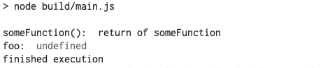
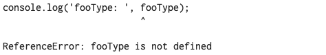

# IsolateModule


Babel transpiler treats each file as an isolated module without aware of the context of this module in a project.  Consider the following:

**listing 1**

```typescript
/// file: babel7/1a-no-transpiler-error/src/export-import.ts

import { someFunction } from "./some-module";
import { foo } from "./some-module";
//       ^^^
//       In isolation, Babel have no way to tell the variable 'foo' is not a value

export { someFunction };
export { foo };

```

when Babel analyses the file in isolation, it cannot tell if the variable `foo`  being import is a value or a type.  Given this situation, If `foo` is  exported and then consumed by another module: 

**listing 2**

```typescript
/// file: babel7/1a-isolateModule-false/src/main.ts

import { someFunction } from './export-import'
import { foo } from './export-import'
//       ^^^ <-- we don't know if this variable is a value or a type

console.log('someFunction(): ', someFunction())
console.log('foo: ', foo)
//                   ^^^
//                   [tsserver 2693] 'foo' only refers
//                   to a type, but is being used as a value here. [E]
console.log('finished execution')
```

In the above IDE are telling you that `foo` is a type but you are using it as a value.  During execution, this should be a [*ReferenceError*](https://developer.mozilla.org/en-US/docs/Web/JavaScript/Reference/Errors/Undeclared_var):

```text
ReferenceError: foo is not defined
```

However, executing the Babel's transpiled javascript you get:



The execution of Babel's transpiled javascript is incorrect, because `foo` only exist in typescript space, in javascript space it was never declared. Using an undecalred variable result in a ReferenceError. A script with ReferenceError should throw.  This descrepency exist because *Babel transpiler does not do type check, it ignores `tsconfig.json`, it simply transpiles the typescript syntax to javascript.*  Your IDE, however, is using the typescript tranpiler (typescript language server to be more exect). Typescript tranpiler aware of the context for each file in the project, therefore it is able to figure out your are attempting to use a type as value. 


### Name type explicitely

One way to help prevent the above error is to **name our type explicitely**:

**listing 3**

```typescript
///file: babel7/1b-naming-type-explicitly/build/main.js

import { someFunction } from './export-import'
import { fooType } from './export-import'
//       ^^^^^^^ <-- the name tells us this variable is a type

console.log('someFunction(): ', someFunction())
console.log('fooType: ', fooType)  // <-- this is obviously a runtime error
//                       ^^^^^^^
//                       [tsserver 2693] 'fooType' only refers
//                       to a type, but is being used as a value here. [E]
console.log('finished execution')
```

By nameing `foo` foo `fooType` we can realized that we are using a type as value and catch the possible problem earlier.  


### Re-exporting a type

Explicitely naming the variable can help, but it will not solve incorrect Babel's transpiled javascript. The root of the problem is not where `fooType` or `foo` is being use as a value.  The problem is in **listing 1** that we are *re-exporting an imported type*.  We can see the problem in the transpiled code: 

**listing 4**

```js
///file: babel7/1a-isolateModule-false/build/export-import.js

"use strict";

Object.defineProperty(exports, "__esModule", {
  value: true
});
Object.defineProperty(exports, "foo", {
  enumerable: true,
  get: function get() {
    return _someModule.foo;
  }
});
Object.defineProperty(exports, "someFunction", {
  enumerable: true,
  get: function get() {
    return _someModule.someFunction;
  }
});

var _someModule = require("./some-module");
```

Notice that the Babel is treating `foo` as value (line 8). The variable `foo` is a type, it should never have present in the transpiled javascript. 

The following is the similiar code transpiled by the typescirpt compiler, and you see that  `foo` is absence:

**listing 5**

```js
///file: tsc/1a--isolateModule-false/build/export-import.js

"use strict";
Object.defineProperty(exports, "__esModule", { value: true });
exports.someFunction = void 0;
var some_module_1 = require("./some-module");
Object.defineProperty(exports, "someFunction", {
  enumerable: true,
  get: function () {
    return some_module_1.someFunction;
  },
});
```

There reason Babel can mistakenly include type in the transpiled code is because Babel transpiler only works with individual file, *it does not see a system of file in a project*.


### compilerOptions.isolatedModules and the type keyword

When using Babel as a transpiler we should set the `compilerOptions.isolatedModules` to `true` in tsconfig.json (the default value is `false`):

```jsonc
/// tsconfig.json
{
  "compilerOptions": {
    ...
    "isolatedModules": true
    ...
  }
}  
```

With isolateModule set to true you are telling the typescript compiler in your IDE that you are using Babel and it should deal with each typescript file in isolation instead it being part of a project -- with the this you see additional type error:

```typescript
/// file: babel7/1c-isolatedModules-true/src/export-import.ts

import { someFunction } from "./some-module";
import { fooType } from "./some-module";

export { someFunction };
export { fooType };  // <--- IDE tells us this can lead to mistake
//       ^^^^^^^
//       [tsserver 1205] Re-exporting a type when the '--isolatedModules'
//       flag is provided requires using 'export type'
```

The message tells us that we should use the keyword `type` during exporting. The `type` keyword is a feature since **typescript version 3.8** and **Babel version 7.9(~?)**. Annotate the `import` and `export` statement with `type` keyword on. the intend is clear:

```typescript
import { someFunction } from "./some-module";
import type { fooType } from "./some-module";

export { someFunction };
export type { fooType };
```

And the the run time is correct:



This because the Babel's transpiled javascript is now correct:

```js
///file: babel7/1d-isolatedModules-true-with-type-keyword/build/export-import.js

"use strict";

Object.defineProperty(exports, "__esModule", {
  value: true
});
Object.defineProperty(exports, "someFunction", {
  enumerable: true,
  get: function get() {
    return _someModule.someFunction;
  }
});

var _someModule = require("./some-module");
```


---

Reference: 

[type-only imports — A new TypeScript feature that benefits Babel users](https://levelup.gitconnected.com/improving-babel-support-for-typescript-with-type-only-imports-28cb209d9460)

[stackoverflow.com/questions/61744429/why-is-export-type-necessary-with-isolatedmodules](https://stackoverflow.com/questions/61744429/why-is-export-type-necessary-with-isolatedmodules)

[https://github.com/babel/babel/issues/6065](https://github.com/babel/babel/issues/6065)

